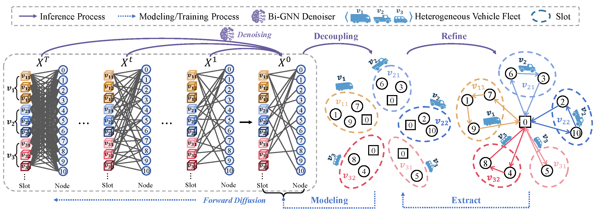
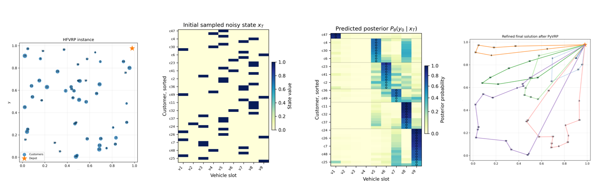
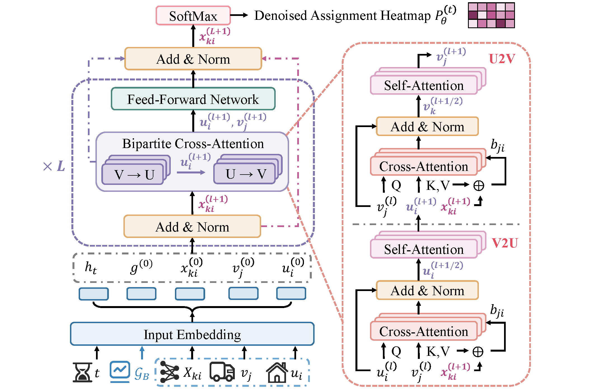

# BigDiff: Bipartite Graph-Based Diffusion Solvers for Vehicle Routing Problems

BigDiff is a bipartite graph-based diffusion framework for vehicle routing problems (VRPs).  
Instead of directly reconstructing a complete visiting sequence, BigDiff decomposes routing into two stages:

1. **Customer-to-slot assignment**: a consistency diffusion model predicts a heatmap that assigns customers to vehicle slots/routes.
2. **Route refinement**: a lightweight local search / PyVRP-based decoder refines the visiting order within each predicted slot.

This design allows the diffusion model to explicitly use both customer-side information and vehicle-side information, including capacity, fixed cost, and distance-related operational cost. It is especially useful for variants such as the Capacitated Vehicle Routing Problem (CVRP) and the Heterogeneous Fleet Vehicle Routing Problem (HFVRP).

---

## Overview

<p align="center">
  
</p>

BigDiff represents each VRP instance as a **slot-customer bipartite graph**.  
A slot corresponds to a candidate route that starts and ends at the depot, while each customer is assigned to one slot. The diffusion model predicts the posterior assignment heatmap:

$$
P_\theta(y_0 \mid x_T)
$$

where $x_T$ is an initial sampled noisy assignment state and $y_0$ is the clean customer-to-slot assignment.

The predicted heatmap is then decoded into feasible routes through capacity-aware projection and route-level refinement.

---

## Method Illustration

### One-step consistency diffusion case visualization

<p align="center">
  
</p>

The case visualization shows the full inference pipeline:

1. Input VRP / HFVRP instance.
2. Initial sampled noisy assignment state $x_T$.
3. Predicted posterior heatmap $P_\theta(y_0 \mid x_T)$.
4. Final decoded and refined routing solution.

Since BigDiff uses a consistency-style diffusion model, inference can be performed in a single denoising step.

### Bi-GNN denoiser architecture

<p align="center">
  
</p>

The Bi-GNN denoiser takes the noisy assignment state and the bipartite instance graph as input, and outputs customer-to-slot assignment logits. These logits are normalized row-wise to form the assignment heatmap used by the decoder.

---

## Repository Structure

```text
.
├── diffusion/              # Core model, dataset, diffusion, decoder, and utility modules
├── scripts/                # Training and evaluation scripts for CVRP and HFVRP
├── static/
│   ├── images/             # Project figures used by the webpage and README
│   ├── css/
│   ├── js/
│   └── videos/
├── environment.yml         # Conda environment specification
├── index.html              # Project webpage
└── train.py                # Main training / evaluation entry point
```

## Installation

Create the conda environment:

```bash
conda env create -f environment.yml
conda activate hfvrp
```
Training

All training scripts are provided in the scripts/ directory.
```bash
chmod +x scripts/*.sh
bash scripts/train_cvrp50.sh
bash scripts/train_cvrp100.sh
bash scripts/train_hfvrp50.sh
bash scripts/train_hfvrp100.sh
```
Evaluation

Evaluation scripts are also provided in scripts/.
```bash
bash scripts/eval_cvrp50.sh
bash scripts/eval_cvrp100.sh
bash scripts/eval_hfvrp50.sh
bash scripts/eval_hfvrp100.sh
```

